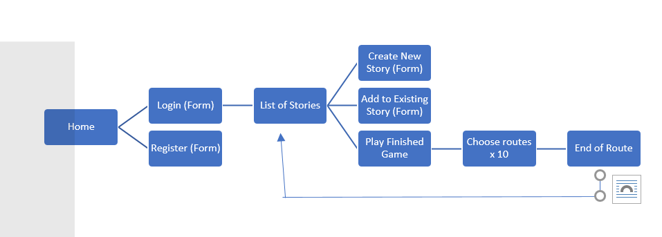

# DIY Life 

## Overview

DIY Life is life, if life were a game. 
Users can collaborate to create their own "choose your own adventure" stories. Given a prompt, users will put down two choices, without knowing what events occured before. These choices will then be passed on to another user to continue the story.
After a certain number of rounds, the story will be complete, and available for all users to play from the beginning.

## Data Model

The application will store Users and Stories
* Stories will be a collection of 10 events (maybe more or less?)
* Each event (excluding the ending) will be linked to two other events
	* These events will be the two choices users choose from

An Example User:

```javascript
{
  username: "doppelganger",
  hash: // a password hash,
}
```

An Example Story:

```javascript
{
  collaborators: // array of users who have added to this already
  title: "Life",
  events: [Event],
  isFinished: boolean
}
```
An Example Event:

```javascript
{
  before: // event that occured before
  after: // event that occurs after, null if is end
  storyLine: String // prompt to display,
}
```


## [Link to Commented First Draft Schema](db.js) 


## Wireframes

(___TODO__: wireframes for all of the pages on your site; they can be as simple as photos of drawings or you can use a tool like Balsamiq, Omnigraffle, etc._)

/list/create - page for creating a new shopping list


/list - page for showing all shopping lists


/list/slug - page for showing specific shopping list


## Site map




## User Stories or Use Cases

1. as non-registered user, I can register a new account with the site
2. as a user, I can log in to the site
3. as a user, I can start a new story
4. as a user, I can add choices to an existing story
5. as a user, I can play different paths in finished stories

## Research Topics

* (5 points) Integrate user authentication
	* sign up and registration
* (5 points) Automate functional testing for all routes
	* Plan to use Selenium
	* Test through all routes in each story

10 points total out of 8 required points

## [Link to Initial Main Project File](app.js) 


## Annotations / References Used

(___TODO__: list any tutorials/references/etc. that you've based your code off of_)

1. [passport.js authentication docs](http://passportjs.org/docs) - (add link to source code that was based on this)
2. [tutorial on vue.js](https://vuejs.org/v2/guide/) - (add link to source code that was based on this)
