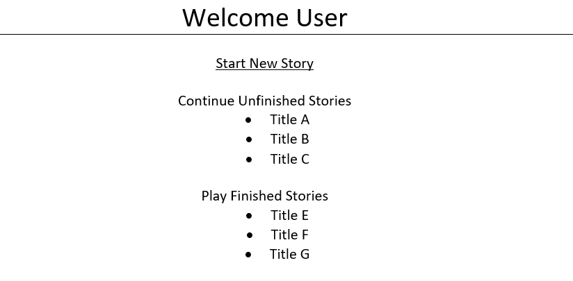
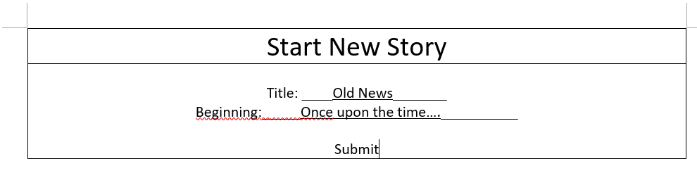
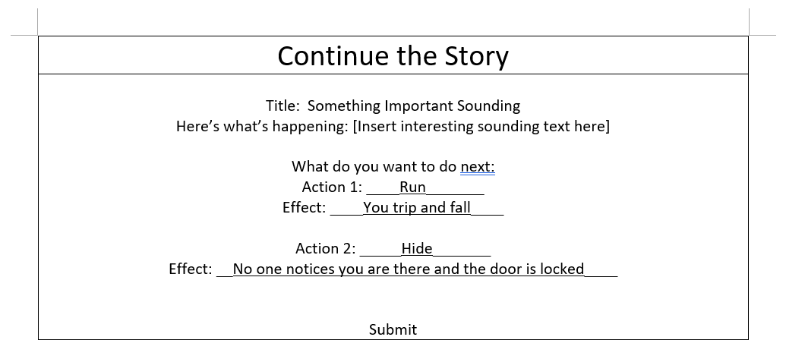
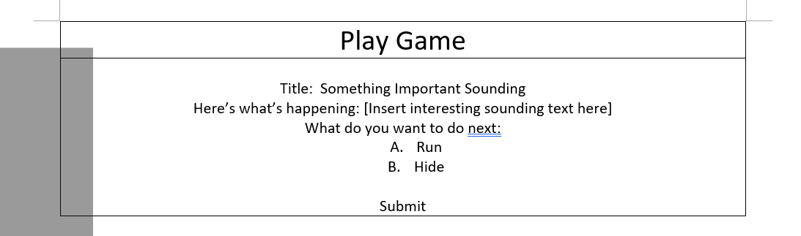

# DIY Life 

## Overview

DIY Life is life, if life were a game. 
Users can collaborate to create their own "choose your own adventure" stories. Given a prompt, users will put down two choices, without knowing what events occured before. These choices will then be passed on to another user to continue the story.
After a certain number of rounds, the story will be complete, and available for all users to play from the beginning.

## Data Model

The application will store Users and Stories
* Stories will be a collection of 10 events (or less?)
	* sort of like a tree?
* Each event (excluding the ending) will be linked to two other events
	* These events will be the two choices users choose from
* Schemas still need a lot of work

An Example User:

```javascript
{
  username: "doppelganger",
  hash: // a password hash,
}
```

An Example Story:

```javascript
{
  collaborators: // array of users who have added to this already
  title: "Life",
  events: [Event],
  isFinished: boolean
}
```
An Example Event:

```javascript
{
  before: // event that occured before
  after: // 2 possible events that occurs after, null if is end
  storyLine: String // prompt to display,
}
```


## [Link to Commented First Draft Schema](db.js) 


## Wireframes

/ - page for logging in or registering


/list - page for showing all stories



/start-new-story - page for creating new story



/continue/slug - page for creating continuing story



/play/slug - page for playing story




## Site map


## User Stories or Use Cases

1. as non-registered user, I can register a new account with the site
2. as a user, I can log in to the site
3. as a user, I can start a new story
4. as a user, I can add choices to an existing story
5. as a user, I can play different paths in finished stories

## Research Topics

* (5 points) Integrate user authentication
	* sign up and register
* (5 points) Automate functional testing for all routes
	* Plan to use PhantomJS
	* Test through all routes in each story

10 points total out of 8 required points

## [Link to Initial Main Project File](app.js) 


## Annotations / References Used
1. [phantomJS](http://phantomjs.org/page-automation.html)
	* Page Automation
	* Add link to source code based on this (none yet)

